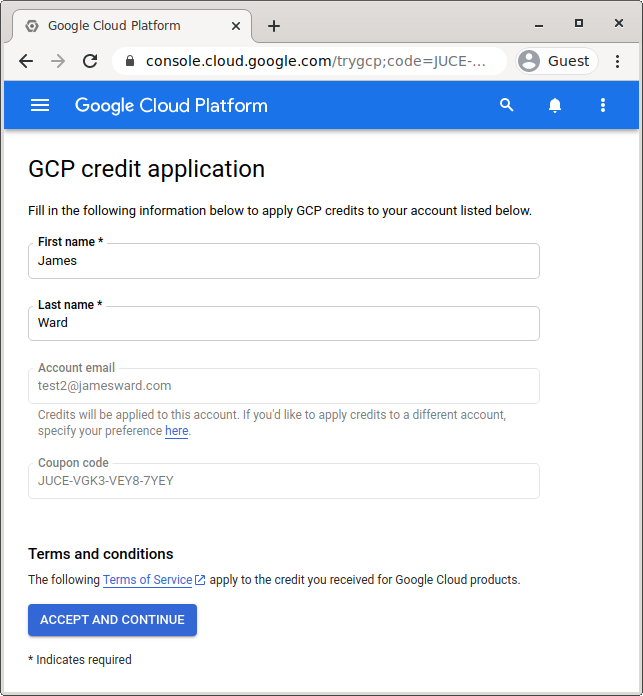

# Hands-On Google Cloud & Confluent Cloud: Real-time Data and Warehousing

In this hands-on workshop you will learn how to stream data from Kafka to the BigQuery data warehouse for offline data queries, analytics, and dashboards.  You will containerize and run a data producer on Google Cloud which sends data to Kafka on Confluent Cloud.  Then a connector will automatically send the data to BigQuery.  You will learn how to perform queries on that data warehouse.

## Lab 1 - Setup

You will get setup on GCP and Confluent Cloud.

### Task 1 - Login to GCP

1. Open a Guest browser window

1. A personal Gmail account MUST be used for this workshop.  If you've already signed up for Confluent Cloud with an existing Gmail account, you will need to create a new one. [Create a new Gmail account](https://accounts.google.com/signup/v2/webcreateaccount?biz=false&flowName=GlifWebSignIn&flowEntry=SignUp) **(if necessary)**.

1. Sign into the [Google Cloud Console](https://console.cloud.google.com/)

1. [Get a coupon code & apply it](https://gcpcredits.com/confluent) so you don't have to pay to do this workshop.  After logging into the gcpcredits site, click the "CLICK HERE TO ACCESS YOUR CREDITS" button and you will be taken to a page in the Google Cloud console that looks like:

    

    After clicking "ACCEPT AND CONTINUE" a Google Cloud project will be created for you.

1. [Open your Project Dashboard](https://console.cloud.google.com/home/dashboard)

### Task 2 - Cloud Shell

You will do most of the work from the Google Cloud Shell, [a command line environment running in the Cloud](https://cloud.google.com/developer-shell/#how_do_i_get_started). 

1. [Open Cloud Shell](https://shell.cloud.google.com/?show=terminal)

1. You should see something like: 
 


1. Try a command like:
    ```bash
    echo "hello, world"
    ```

### Task 3 - Setup Apache Kafka® on Confluent Cloud™

You need to setup Confluent Cloud through the Google Cloud Marketplace.

1. [Open Apache Kafka® on Confluent Cloud™ in the Google Cloud Marketplace](https://console.cloud.google.com/marketplace/product/endpoints/payg-prod.gcpmarketplace.confluent.cloud)

    

1. Click "SUBSCRIBE"

1. Review and agree to the terms (if you agree) and click "SUBSCRIBE"

    

1. The "order request" will be sent to Confluent and then click "GO TO PRODUCT PAGE"

    

1. Now click the "ENABLE" button:

    

1. Click the "MANAGE VIA CONFLUENT" button:

    

1. Signup for a new Confluent Cloud account using the **SAME** email as for Google Cloud:

    

1. Check your email for the verification link and click it to login to Confluent Cloud


### Task 4 - Create a Basic Kafka Cluster

1. Select the "Basic" cluster type and click the "Begin configuration" button:

    

1. Select the "us-central1" region and "Single zone" availability:

    

1. Launch the cluster:

    

### Task 5 - Setup Confluent Cloud CLI

1. Install the CLI in Cloud Shell:

    ```bash
    mkdir ~/bin
    curl -L --http1.1 https://cnfl.io/ccloud-cli | sh -s -- -b ~/bin
    export PATH=~/bin:$PATH
    ```

1. Login to Confluent Cloud:

    ```bash
    ccloud login --save
    ```

### Task 6 - Set Kafka Env Vars

1. Get your environment id:

    ```bash
    ccloud environment list
    ```

1. Tell `ccloud` to use the environment:

    ```bash
    ccloud environment use YOUR_ENV_ID
    ```

1. You should have already created a cluster from the Confluent Cloud web console. Now setup API access:

    ```bash
    export CLUSTER_ID=`ccloud kafka cluster list -o json | jq -r '.[0].id'`

    ccloud kafka cluster use $CLUSTER_ID

    read KAFKA_USERNAME KAFKA_PASSWORD < <(echo $(ccloud api-key create --resource $CLUSTER_ID -ojson | jq -r '.key, .secret'))

    export KAFKA_USERNAME KAFKA_PASSWORD

    ccloud api-key use $KAFKA_USERNAME --resource $CLUSTER_ID
    ```

1. Set an env var for the Kafka Bootstrap Servers:

    ```bash
    export KAFKA_BOOTSTRAP_SERVERS=`ccloud kafka cluster describe $CLUSTER_ID -ojson | jq -r '.endpoint'`
    ```

1. Create the Schema Registry, API Key, and set the necessary env vars along the way:

    ```bash
    read SCHEMA_REGISTRY_ID SCHEMA_REGISTRY_URL < <(echo $(ccloud schema-registry cluster enable --cloud gcp --geo us -ojson | jq -r '.id, .endpoint_url'))

    export SCHEMA_REGISTRY_ID SCHEMA_REGISTRY_URL

    read SCHEMA_REGISTRY_KEY SCHEMA_REGISTRY_PASSWORD < <(echo $(ccloud api-key create --resource $SCHEMA_REGISTRY_ID -ojson | jq -r '.key, .secret'))

    export SCHEMA_REGISTRY_KEY SCHEMA_REGISTRY_PASSWORD
    ```

1. Wait a minute for the Schema Registry to be ready, then test it works:

    ```bash
    curl --silent -u "$SCHEMA_REGISTRY_KEY:$SCHEMA_REGISTRY_PASSWORD" $SCHEMA_REGISTRY_URL | jq
    ```

    **Note: Since you don't have any schemas yet you should see and empty JSON object: `{}`**

    **Note: If you get an "Unauthorized" response, wait longer and try again.**

### Task 7 - Start a ksqlDB application

1. On the menu on the left, click on ksqlDB, then "Create Application Myself".

1. Select "Global access", give the application a name and launch it

    

1. The application will launch in the background, it will take several minutes, we will come back to it in Lab 3.

### Task 8 - Test Kafka

1. Create a test topic:

    ```bash
    ccloud kafka topic create test-topic
    ```

    Check out the topic in the Confluent Cloud console.

1. Send a message to the topic:

    ```bash
    echo "test" | ccloud kafka topic produce test-topic
    ```

    **Note: If you get an error, you were too fast and need to wait a minute until the cluster finishes provisioning.**

1. Consume the messages from the beginning:

    ```bash
    ccloud kafka topic consume -b test-topic
    ```

### Task 9 - Save Kafka env vars

1. Make sure you have all 6 env vars set: (`KAFKA_BOOTSTRAP_SERVERS`, `KAFKA_USERNAME`, `KAFKA_PASSWORD`, `SCHEMA_REGISTRY_URL`, `SCHEMA_REGISTRY_KEY`, `SCHEMA_REGISTRY_PASSWORD`):

    ```bash
    export|grep -e KAFKA -e SCHEMA
    ```
1. Write the config to a properties file:

    ```bash
    cat <<EOF > ~/prod.properties
    kafka.bootstrap.servers=$KAFKA_BOOTSTRAP_SERVERS
    kafka.username=$KAFKA_USERNAME
    kafka.password=$KAFKA_PASSWORD
    schema.registry.url=$SCHEMA_REGISTRY_URL
    schema.registry.key=$SCHEMA_REGISTRY_KEY
    schema.registry.password=$SCHEMA_REGISTRY_PASSWORD
    EOF
    ```

## Lab 2 - Stream Producer

You will now produce a stream of messages to Kafka using a Java Spring Boot application. Our source of messages will be a stream of Stack Overflow questions pulled from a public data set.  You can see the source stream at: <https://stackoverflow-to-ws-x5ht4amjia-uc.a.run.app/>

1. Set an env var for your project id:

    ```bash
    gcloud projects list
    export PROJECT_ID=YOUR_PROJECT_ID
    ```

1. In Cloud Shell, get the source with git:

    ```bash
    git clone https://github.com/jamesward/hands-on-java-spring-kafka.git
    ```

1. Go into the source directory:

    ```bash
    cd hands-on-java-spring-kafka
    ```

1. Create a container image for the ws-to-kafka application:

    ```bash
    ./gradlew :ws-to-kafka:bootBuildImage \
      --imageName=gcr.io/$PROJECT_ID/jsk-ws-to-kafka
    ```

1. Run with Cloud Shell:

    ```bash
    docker run -it \
      -v$HOME/prod.properties:/workspace/prod.properties \
      -eSPRING_CONFIG_ADDITIONAL-LOCATION=file:prod.properties \
      gcr.io/$PROJECT_ID/jsk-ws-to-kafka
    ```

1. Check out the messages to mytopic in the Confluent Cloud console:

    

## Lab 3 - Data Transformation with ksqlDB

Our streaming producer is feeding information in JSON format, but we'll see the strongest capabilities of Schema Registry paired with BigQuery when we process our data in AVRO format. To do that quick data transformation we're going to use a very simple ksqlDB application.

1. Let's find that ksqlDB application we created on Lab 1

1. Go to the menu on the left and again select ksqlDB, your application should now show status "Up".

1. First, we're going to create a stream that mirrors the JSON data in the topic `mytopic`.

    ```sql
    CREATE STREAM mystream WITH (    
        KAFKA_TOPIC='mytopic',    
        VALUE_FORMAT='JSON_SR'
    );
    ```
    
    
    **Note: If you get an error with the SQL commands, try typing it out vs using copy-paste.**
    

    

1. Run a new query against the new stream:

    ```sql
    select * from MYSTREAM EMIT CHANGES;
    ```

    

1. Now, we'll create a different stream that takes that one and transforms it into an AVRO format, mirroring the messages directly into a new topic `myavrotopic`.

    ```sql
    CREATE STREAM MYAVROSTREAM WITH (
        VALUE_FORMAT='AVRO',
        KAFKA_TOPIC='myavrotopic'
    ) AS SELECT * FROM mystream;
    ```

The data in `myavrotopic` is now ready to be streamed into BigQuery.

## Lab 4 - Configure BigQuery Connector

1. Go to the Google Cloud Console, go to "IAM & Admin" > "Service Accounts"

1. Click on "Create Service Account"

1. Give it a name and grant it the "BigQuery Admin" role

    

1. Find the recently created service account on the list, click on the three dots to the right and then "Manage Keys"

1. Then "Add Key" > "Create new key" and create a new JSON private key. A file will be downloaded. 

1. Go now into BigQuery, select the three dots to the right of your project name (on the left menu) and "Create New Dataset". Name it `mydataset`.

1. Now back on the Confluent Cloud UI, let's create a Connector that sends the data from our topic to the BigQuery dataset we just created. Click on "Connectors" on the left menu. 

1. From the list of connectors, select Google BigQuery sink connector

    

1. Select `myavrotopic` as your ingestion topic and change the Input Message Format as AVRO.

1. Generate a new Kafka API Key & Secret.

1. Upload the GCP credentials file you downloaded on step 5 of this lab. 

1. Under BigQuery details, input your ProjectID as well as the name of the dataset we just created. 

1. For SQL/DDL Support, we're going to let Confluent's Schema Registry do all the work. Select the following values:

    

1. Give 1 task to the connector and click "Next". Verify everything looks correct and Launch the connector. 

1. Once the connector is created it will take a few minutes for it to start.

1. Back in the Google Cloud Console, in the BigQuery UI, you should see a table `myavrotopic` show up under `mydataset`. If you click to see the details, the table will already have the columns from your message schema. Under table details, you may see that the table size is still 0 B, but the Streaming Buffer Statistics should show some data. You're free to query the data as it comes in.

## Lab 5 - Query Data Using BigQuery

### Task 1 - Run Queries to Explore Data

1. In the Google Cloud Console, select "Navigation Menu" > "BigQuery".

    

1.  The "Welcome to BigQuery in the Cloud Console" message box opens. This message box provides a link to the quickstart guide and the release notes. Click "Done". The BigQuery console opens.

1. In the Explorer pane, open `mydataset` and click on the table named `myavrotopic`. You should see the table's schema which includes the field names and the data types.

    

1. Click on the "Preview" tab to view a subset of the data.

    

1. In the upper right corner, click on "Compose New Query" and paste the following query in the editor which will return data for the *Top 10 most viewed Stack Overflow posts*:

    ```sql
    select distinct
       title,
       body,
       url,
       view_count
    from
       `mydataset.myavrotopic`
    order by view_count DESC
    limit 10;
    ```

1. Once again, click on "Compose New Query" in the upper right corner and paste the following query in the editor which will return data for the *Top 10 programming languages most commonly found in Stack Overflow posts*:

    ```sql
    SELECT
       Programming_Language,
       COUNT(*) AS Total_Num_of_Posts
    FROM
       (
       SELECT CASE
         WHEN LOWER(Tags_Unnested) LIKE '%python%' THEN 'Python'
         WHEN LOWER(Tags_Unnested) LIKE '%node.js%' THEN 'Node.js'
         WHEN LOWER(Tags_Unnested) LIKE '%java%' THEN 'Java'
         WHEN LOWER(Tags_Unnested) LIKE '%ruby%' THEN 'Ruby'
         WHEN LOWER(Tags_Unnested) LIKE '%c#%' THEN 'C#'
         WHEN LOWER(Tags_Unnested) LIKE '%c++%' THEN 'C++'
         WHEN LOWER(Tags_Unnested) LIKE '%sql%' THEN 'SQL'
         WHEN LOWER(Tags_Unnested) LIKE '%css%' THEN 'CSS'
         WHEN LOWER(Tags_Unnested) LIKE '%html%' THEN 'HTML'
         WHEN LOWER(Tags_Unnested) LIKE '%react%' THEN 'React'
         ELSE 'NA' END AS Programming_Language
       FROM   
           (
           SELECT
               DISTINCT Title, Tags_Unnested
           FROM
               `mydataset.myavrotopic`
           JOIN UNNEST(Tags) as Tags_Unnested
           )
       )
    WHERE
       Programming_Language <> 'NA'
    GROUP BY
       Programming_Language
    ORDER BY
       COUNT(*) DESC;
    ```

1. Click "Run" to return the query's result.

    Feel free to run any custom queries against the dataset.

### Task 2 - Run Query to Find Average Number of Days For a Response (By Programming Language and Year)

1. In the Explorer pane of the left, click "Add Data" > "Explore Public Datasets".

    

1. In the search bar, type "stack overflow" and click on the tile that appears. 

    

1. Click "View Dataset".

    

    You should now see a project appear called `bigquery-public-data`.

1. Click on "Compose New Query" in the upper right corner.

1. Building on the last query in Task 1, paste the following query in the editor which will return data for the *Average Number of Days For a Response (By Programming Language and Year)*:

    ```sql
    SELECT Programming_Language, Year, Avg(Number_of_Days_for_Response) as Average_Number_of_Days_for_Answer
    FROM (
       SELECT
       id as Question_ID, Programming_Language, EXTRACT(YEAR FROM Question_Post_Date) as Year, DATETIME_DIFF(question_answer_date, question_post_date, DAY) as Number_of_Days_for_Response
       FROM (
           SELECT
              questions.id,
              CASE
                WHEN LOWER(Tags_Unnested) LIKE '%python%' THEN 'Python'
                WHEN LOWER(Tags_Unnested) LIKE '%node.js%' THEN 'Node.js'
                WHEN LOWER(Tags_Unnested) LIKE '%java%' THEN 'Java'
                WHEN LOWER(Tags_Unnested) LIKE '%ruby%' THEN 'Ruby'
                WHEN LOWER(Tags_Unnested) LIKE '%c#%' THEN 'C#'
                WHEN LOWER(Tags_Unnested) LIKE '%c++%' THEN 'C++'
                WHEN LOWER(Tags_Unnested) LIKE '%sql%' THEN 'SQL'
                WHEN LOWER(Tags_Unnested) LIKE '%css%' THEN 'CSS'
                WHEN LOWER(Tags_Unnested) LIKE '%html%' THEN 'HTML'
                WHEN LOWER(Tags_Unnested) LIKE '%react%' THEN 'React'
                ELSE 'NA' END AS Programming_Language,
               MIN(Answers.Creation_Date) AS  Question_Answer_Date,
               MIN(Questions.Creation_Date) AS Question_Post_Date
           FROM
               `mydataset.myavrotopic` AS Lab_Dataset
           JOIN
               `bigquery-public-data.stackoverflow.posts_questions` AS Questions ON Lab_Dataset.TITLE = questions.title
           JOIN
               `bigquery-public-data.stackoverflow.posts_answers` AS Answers ON questions.id = answers.parent_id
           JOIN
               UNNEST(Lab_Dataset.Tags) as Tags_Unnested
           GROUP BY
               Questions.Id, Programming_Language
           )
       WHERE
       Programming_Language <> 'NA' AND DATETIME_DIFF(question_answer_date, question_post_date, DAY) >= 0
      )
    GROUP BY
      Programming_Language, Year
    ORDER BY
      Programming_Language, Year, Average_Number_of_Days_for_Answer asc;
    ```

1. Click "Run" to return the query's result.

### Task 3 - Run Query to Find Number of Active Users vs Total Users By Year

1. Click on "Compose New Query" in the upper right corner.

1. Paste the following query in the editor which will return data for the *Number of Active Users vs. Total Users By Year*:

    ```sql
    SELECT
       Active.Year, Active_Users, Total_Users
    FROM
       (SELECT
           YEAR,
           COUNT(USER_ID) as Active_Users
       FROM
           (SELECT DISTINCT
               EXTRACT(YEAR FROM questions.creation_date) as Year,
               Questions.owner_user_id as User_Id
           FROM
                   `mydataset.myavrotopic` AS Lab_Dataset
               JOIN
                   `bigquery-public-data.stackoverflow.posts_questions` AS Questions ON Lab_Dataset.TITLE = questions.title
               JOIN
                   `bigquery-public-data.stackoverflow.users` AS Users ON Questions.owner_user_id = Users.id
           UNION DISTINCT
           SELECT DISTINCT
               EXTRACT(YEAR FROM Answers.creation_date) as Year,
               Answers.owner_user_id as User_Id
           FROM
               `mydataset.myavrotopic` AS Lab_Dataset
               JOIN
                   `bigquery-public-data.stackoverflow.posts_questions` AS Questions ON Lab_Dataset.TITLE = questions.title
               JOIN
                   `bigquery-public-data.stackoverflow.posts_answers` AS Answers ON Questions.id = Answers.Parent_Id
               JOIN
                   `bigquery-public-data.stackoverflow.users` AS Users ON Answers.owner_user_id = Users.id)
       GROUP BY
           YEAR
       ORDER BY
           YEAR
       ) AS Active
    JOIN
       (SELECT
           Year,
           SUM (Number_of_Users) OVER (ORDER BY Year) AS Total_Users
        FROM
           (
           SELECT EXTRACT(YEAR FROM creation_date) AS Year, count(id) as Number_of_Users
           FROM `bigquery-public-data.stackoverflow.users`
           GROUP BY Year
           ORDER BY Year
           )
       ) AS Totals ON Active.Year = Totals.Year
    ORDER BY Year ASC;
    ```

1. Click "Run" to return the query's result.

## Lab 6 - Visualize Data Using Data Studio

### Task 1 - Create a Graph To Visualize Query from Lab #5 - Task 2

1. Return to the Editor tab where the query was run to get the *Average Number of Days Between a Question Being Posted* and the *Question Being Answered (By Programming Language and Year)*. If you closed that tab, rerun the query in Lab #5 - Task #2 - Step #6.

1. In the "Query Results" pane at the bottom, click "Explore Data" > "Explore with Data Studio".

    

1. On the "Welcome page", click on "GET STARTED".

1. Click on "AUTHORIZE" for the notice that "Data Studio requires authorization to connect to your BigQuery projects."

    In the top left corner, change the title of the dashboard to: `Average Number of Days For Response`

    

1. In the upper right corner labeled "Chart > Table", select "Time Series Chart".

    

1. In the "Data" tab, click on the `Record Count` column under "Metric" and change column to `Average_Number_of_Days_for_Answer`. 

    

1. A chart like the following one should be displayed:

    

1. In the upper left corner, click "Add a chart". Under the "Bar" section, select the 1st graph which should be "Column Chart".

    

    

1. Verify that under the "Data" tab, `Programming_Language` is in the "Dimension" section, `Average_Number_of_Days_for_Answer` (SUM) is in the "Metric" section and `Average_Number_of_Days_for_Answer` (SUM) is in the "Sort" section as "Descending".

    

1. The result should be the following two graphs being displayed:

    

### Task 2 - Create a Chart To Visualize Query from Lab #5 - Task 3

1. Return to the "Editor" tab where the query was run to get the *Number of Active Users vs. Total Users By Year*. If you closed that tab, rerun the query in Lab #5 - Task #3 - Step #2.

1. In the "Query Results" pane at the bottom, click "Explore Data" > "Explore with Data Studio".

    

1. If prompted, on the "Welcome" page, click on "GET STARTED".

1. If prompted, click on "AUTHORIZE" for the notice that "Data Studio requires authorization to connect to your BigQuery projects."

1. In the top left corner, change the title of the dashboard to: `Number of Active Users on StackOverflow`

    

1. In the upper right corner labeled "Chart" > "Table", select "100% Stacked Bar Chart".

    

1. In the "Data" tab, under the "Breakdown Dimension" section, remove the `Active_Users` column. Under the "Metric" section, drag the `Active_Users` column from the "Available  Fields" section to the right and replace the "Record Count" column. Drag the `Total_Users` column as a 2nd metric under the "Metric" section. Re-select the "100% Stacked Bar Chart" graph option. Under the "Sort" section, click on the column displayed and change to the `Year` column and then select the "Ascending" radio button. The "Data" pane should look as followed:

    

1. The result should be the following graph being displayed:

    

1. In the upper left corner, click "Add a chart". Under the "Time Series" section, select the 1st graph which should be "Time Series Chart".

    

    

1. Verify that under the "Data" tab, `Year` is in the "Dimension" section and `Active_Users` is in the "Metric" section..

    

1. The result should be the following two graphs being displayed:

    

## Lab 7 - Cleanup

1. In the Confluent Cloud dashboard, go to ksqlDB.

1. Click "Delete" on the ksqlDB application and follow instructions to complete the delete process.

1. In the Confluent Cloud dashboard, go to Connections, select the BigQuery connector, select settings and the "trash" icon.  Follow the instructions to complete the delete process.

1. In the Confluent Cloud dashboard, go to the Cluster settings, click "Delete cluster" and follow instructions to complete the delete process.
